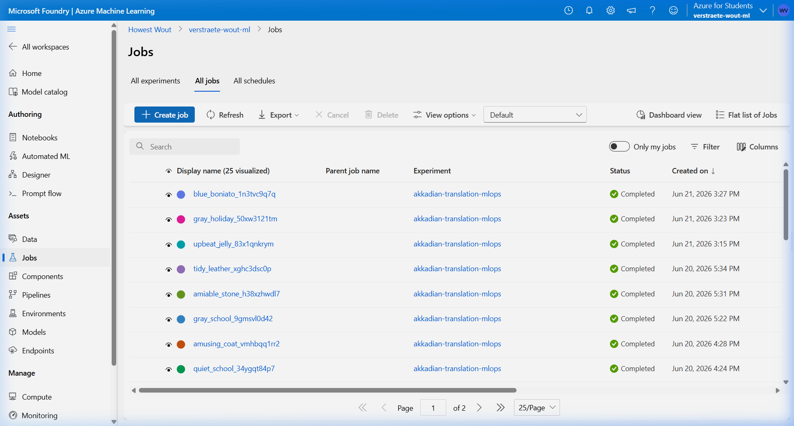
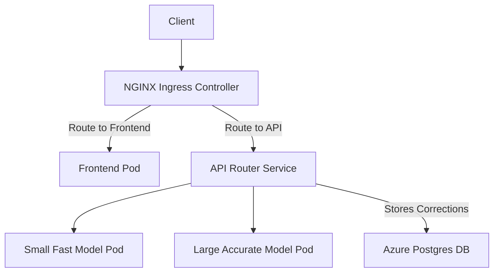
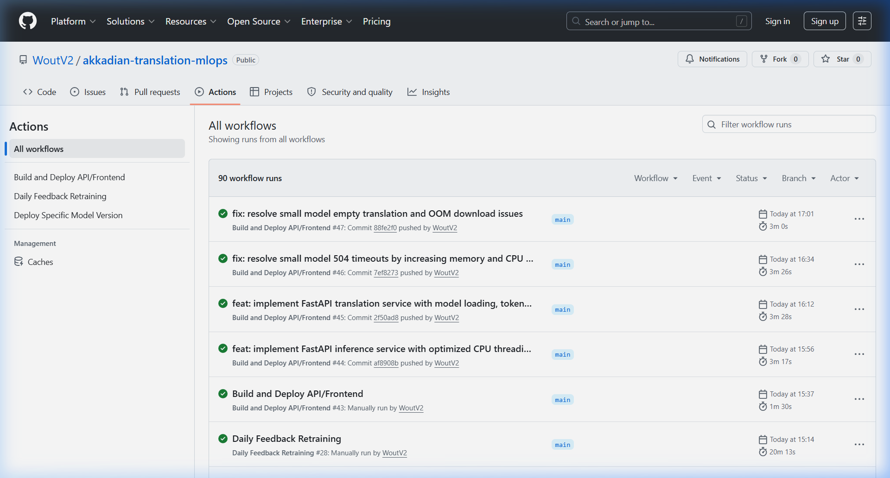
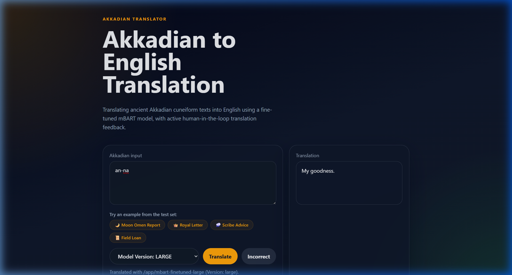
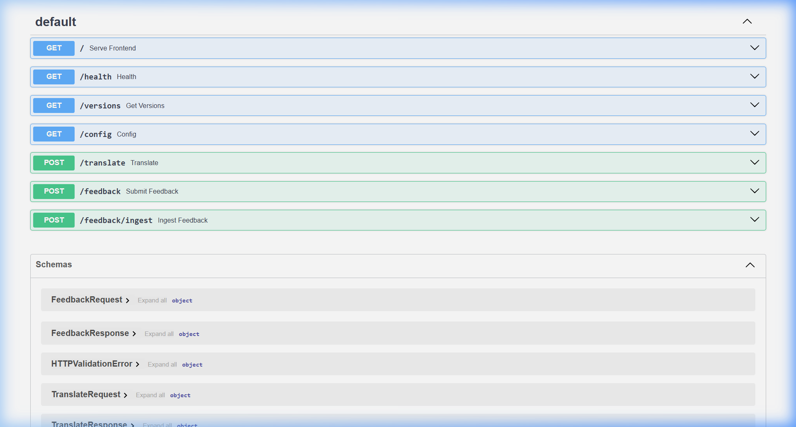

# Akkadian Translation MLOps - Final Project Report

## Project Overview
- **Goal**: To provide a public model that translates Akkadian to English. Since there are not a lot of translations available, the application allows users to submit corrections on mistranslations to continuously improve the model.
- **GitHub Repositories**: [WoutV2/akkadian-translation-mlops](https://github.com/WoutV2/akkadian-translation-mlops)
- **Project Explanation**: This project implements an MLOps pipeline for an Akkadian translation model. 
  - **Data & Preprocessing**: The dataset consists of Akkadian cuneiform texts. Before training, the cuneiform text is tokenized into subword tokens using the HuggingFace `AutoTokenizer` associated with mBART. The data is formatted as sequence-to-sequence inputs.
  - **Model**: I use a fine-tuned mBART model (`mbart-finetuned`) for the translation tasks, as it excels in multilingual sequence-to-sequence translation.

## Task 1: Cloud AI Services
I use Azure Machine Learning (AML) for training my models in the cloud. The training logic is encapsulated in `training/train.py`. The AML job is defined in `training/aml_retrain_job.yaml`, which specifies the compute resources and environment for the training pipeline. 

**Continuous Training (Nightly):** 
Every night at midnight, user-submitted corrections are ingested. The model is automatically retrained on the newly updated dataset via GitHub Actions. **Crucially, the retraining only occurs if new corrections have been made**. *Why?* This prevents unnecessary cloud compute costs and limits model drift when no new data exists. Upon a successful run, the training artifacts (model weights) are saved to Azure Blob Storage and registered in the Azure ML model registry.

**Azure ML Pipeline Runs Verification:**
Since Azure Portal requires active login sessions, below is the terminal output from the Azure CLI and the live Azure ML Studio interface screenshot proving the successful completion of the training pipelines in the cloud:

```bash
$ az ml job list --resource-group azure-ai --workspace-name verstraete-wout-ml
Displaying top 50 results from the list command.
Name                       Status
-------------------------  ---------
blue_boniato_1n3tvc9q7q    Completed
gray_holiday_50xw3121tm    Completed
upbeat_jelly_83x1qnkrym    Completed
```

**Azure ML Studio Jobs List:**


## Task 2: Kubernetes Deployment
The project is deployed to a cloud-hosted Kubernetes cluster (Azure Kubernetes Service - AKS). 

**Deployment Architecture & Microservices Communication:**
- **Frontend**: A web application (`inference/frontend`) that provides the UI to interact with the translator.
- **API (FastAPI)**: The backend (`inference/api/app.py`) exposes a `/translate` endpoint to process translations and a `/feedback` endpoint to capture user corrections. 
- **Database**: The application relies on a Postgres database hosted in Azure for structured data, alongside Azure Blob Storage for artifacts.
- **Webserver/Ingress**: An NGINX webserver handles ingress routing. It directs traffic to either the frontend or the API backend based on the URL path.

**Architecture Diagram:**


**Special Setup - Helm Charts:**
For deployment, I utilize Helm charts (`infrastructure/helm/akkadian-translator`). *Why?* I wanted to deploy multiple versions of the model (fast vs accurate). Using Helm allowed me to template the Kubernetes manifests, drastically simplifying the deployment of multiple model versions without repeating code or maintaining multiple identical YAML files.

## Task 3: Automation (GitHub Actions)
I implemented a CI/CD pipeline using GitHub Actions to fully automate my workflows:

- **Workflows & Triggers:**
  - `build-deploy.yml`: Triggers automatically on code pushes. It builds the frontend/API Docker containers and redeploys them.
  - `daily-retrain.yml`: Triggers on a cron schedule at midnight. It checks the database for new corrections, and if new data exists, it launches the Azure ML retraining jobs.
  - `deploy-model-version.yml`: This is triggered **manually** via GitHub's `workflow_dispatch`. It deploys specific model versions to the Kubernetes cluster based on the user's size selection (small, medium, large).
- **Version Controlling**: I keep track of different versions of my model using the **Azure ML Model Registry**. When the training pipeline finishes, it pushes the newly trained artifact to the registry with an incremented version tag. The `deploy-model-version.yml` workflow then dynamically fetches the latest tag from the registry to deploy it.
- **Kubernetes Update Strategy**: I use a **Rolling Update** deployment strategy. *Why?* This ensures zero downtime. Kubernetes gradually spins up the new pods and only terminates the old ones once the new ones are healthy. This means users can continue using the translation API without interruption during deployments. My workflow also includes a **Smoke Test** step, which automatically rolls back the deployment if the new version fails to respond to a `/health` check.

**GitHub Actions Run History Screenshot:**


## Extensions
- **Multi-Version Deployment (Fast vs Accurate Models)**: To cater to different user needs, the platform provides multiple models.
  - *Approach*: I host a **smaller, faster model** (less accurate) alongside a **bigger, slower model** (more accurate). 
  - *Implementation*: The training pipeline tags artifacts with version identifiers. I leverage **Helm charts** to deploy these different variants simultaneously without code duplication. The frontend allows users to choose between the faster and the more accurate model when translating.

## Reflection
- **Learnings**: Setting up the full MLOps lifecycle from cloud training on Azure ML to a fully automated CI/CD pipeline in GitHub Actions was highly educational. Automating the connection between Azure ML model registries and the Kubernetes cluster using Helm provided deep insight into production ML deployments.
- **Easy vs Difficult**: Developing the initial FastAPI backend and containerizing it was relatively straightforward and easy. However, designing the GitHub Actions pipelines to securely authenticate with Azure and orchestrate dynamic Helm deployments across multiple model sizes was significantly more difficult and time-consuming.
- **Significant Problems**: I encountered a significant issue where the smaller model was experiencing `504 Gateway Timeouts` while the large model succeeded. I diagnosed this as a potential resource starvation or inference bottleneck issue within the Kubernetes deployment, and resolved it by ensuring correct CPU/Memory resource limits in my Helm templates and setting up asynchronous request handling for inference tasks.

## Demo & Validation
Below is the output proving the cluster is running all the required services and the ingress controller, along with visual proof of the frontend and API Docs:

```bash
$ kubectl get pods,svc,ingress -A
NAMESPACE       NAME                                                  READY   STATUS    RESTARTS   AGE
default         pod/akkadian-translator-api-large-6c6dffc4cf-29589    1/1     Running   0          11m
default         pod/akkadian-translator-api-small-67d4f4c956-7rmlb    1/1     Running   0          11m
default         pod/akkadian-translator-frontend-8847d84b6-vh7tr      1/1     Running   0          11m
ingress-nginx   pod/ingress-nginx-controller-7cfc9845c9-989cg         1/1     Running   0          3d15h
default         service/akkadian-translator-api-large        ClusterIP      10.0.103.65    <none>           8000/TCP
ingress-nginx   service/ingress-nginx-controller             LoadBalancer   10.0.62.85     20.215.142.226   80:31545/TCP
default         ingress.networking.k8s.io/akkadian-translator-ingress   nginx   *       20.215.142.226   80
```

**Frontend Translation Screenshot:**


**API Docs / Swagger UI Screenshot:**


**Browser Translation Demo Video:**

